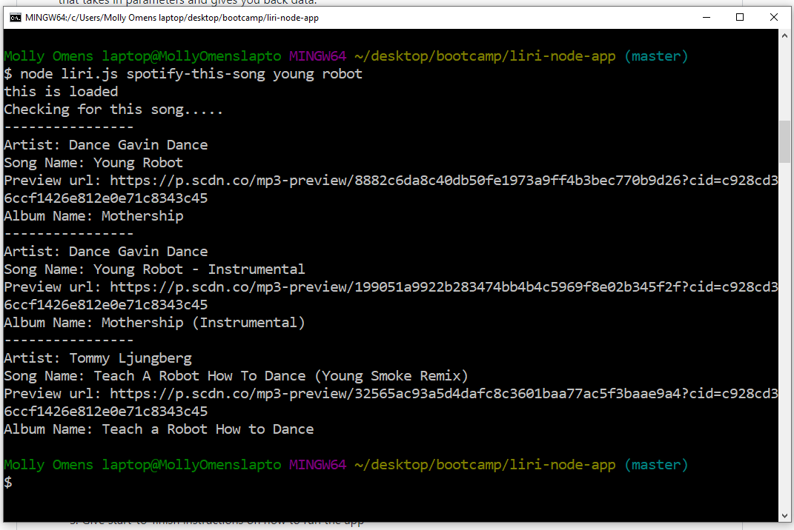
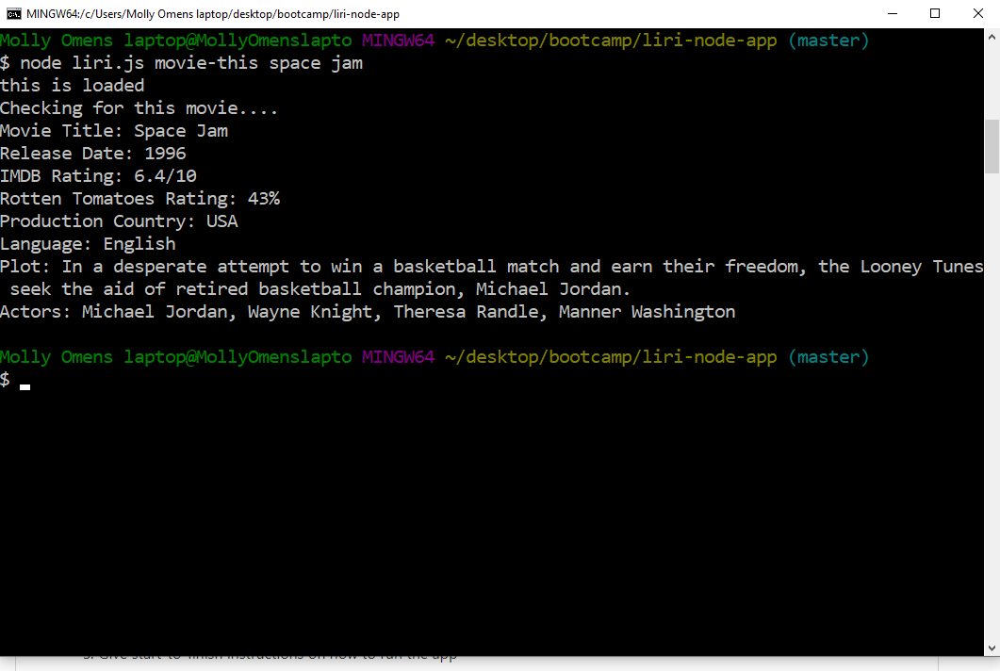
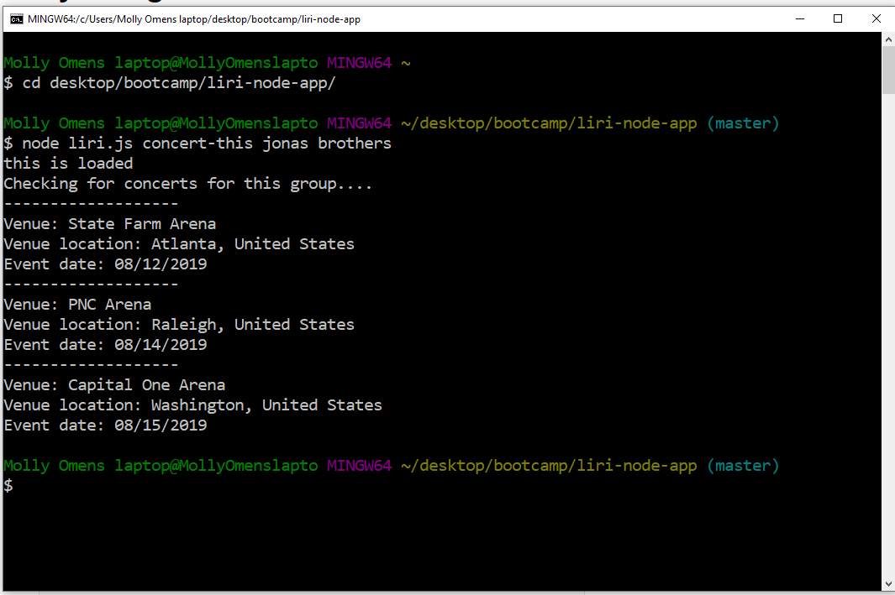
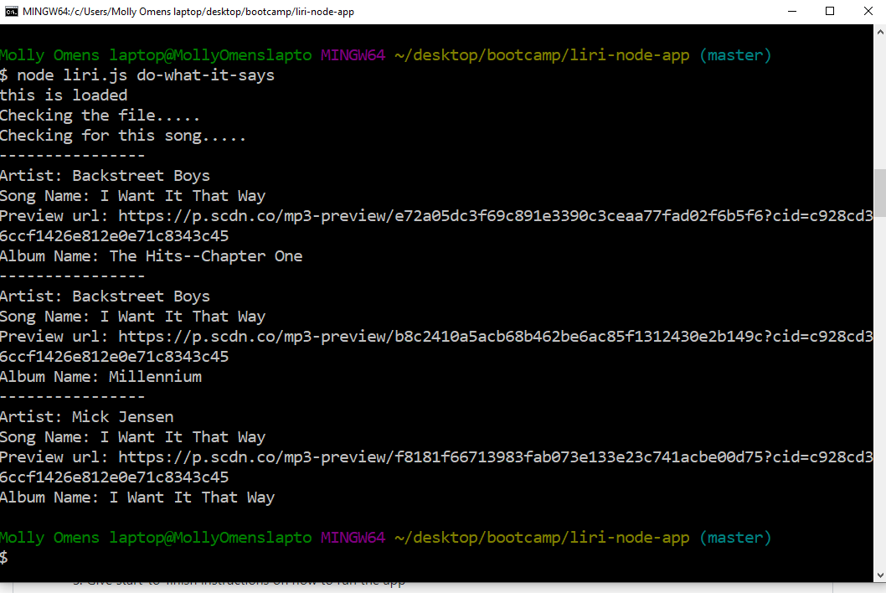
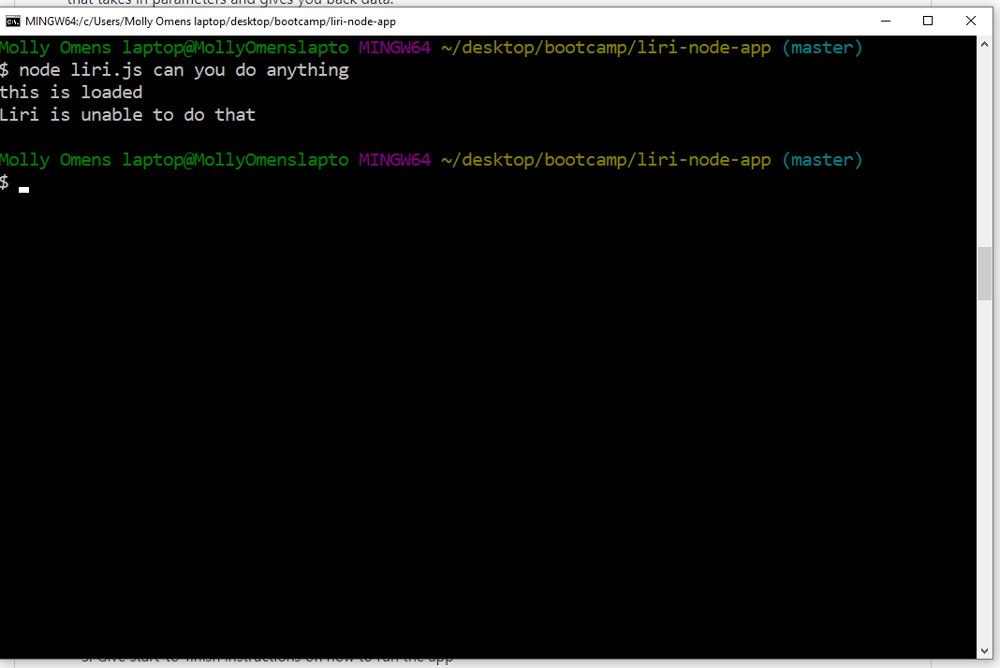

# Liri-node-app

### Purpose
The liri-node-app allows the user to access a variety of information about songs, movies, and concerts in one application. By using the command line, the user selects a category to search and then selects an item from that category to search.

### Directions for App use
1. Decide whether you want to search for a song, movie, or concert.
    1. The command for song is: **spotify-this-song**
    1. The command for movie is: **movie-this**
    1. The command for concert is: **concert-this**
    1. To choose a random item thats in random.txt to be displayed on the console the command is: **do-what-it-says**
1. Choose which song, movie, or concert you wish to search for.
1. In the command line, once you are in the project directory, type in "node liri.js _catergory you chose_ **search item you chose**"
1. Hit enter and watch the results appear!

### Examples of app function
* **spotify-this-song**

* **movie-this**

* **concert-this**

* **do-what-it-says**

* **If you don't enter a correct command**
